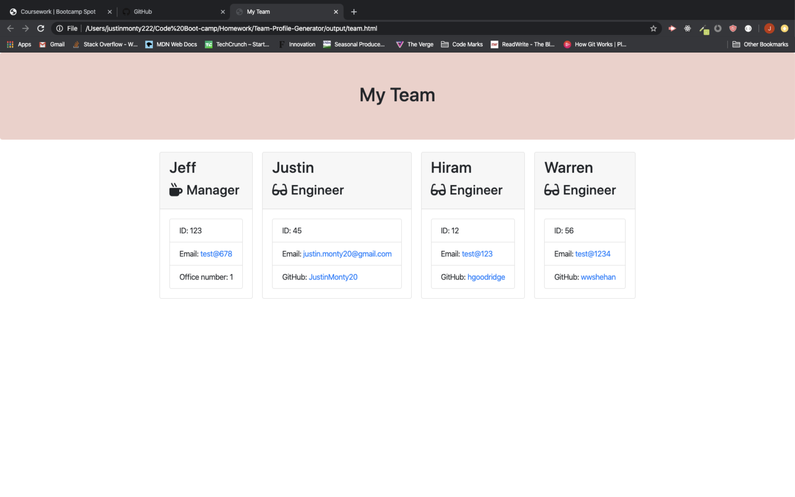

as a manager I want a way to quickly generate my teams contact info
so I have rapid access to emails and GitHubs

1. user will start to run the generator in the command line with node app.js.
2. there they will be asked a series of questions about the employee's they would like to add to their team.
3. such as the employee's name, id #, and email along with their role in the company.
4. based on what role the employee has in the company a specific question will be asked.
5. after the user answers the role specific question they will be asked if they want to add another employee and the questions will begin again if they say yes.
6. if the user answers no their team profile will be created and written to the "output" folder.

here is the link to the deployed site on Github Pages:
https://justinmonty20.github.io/Team-Profile-Generator/

